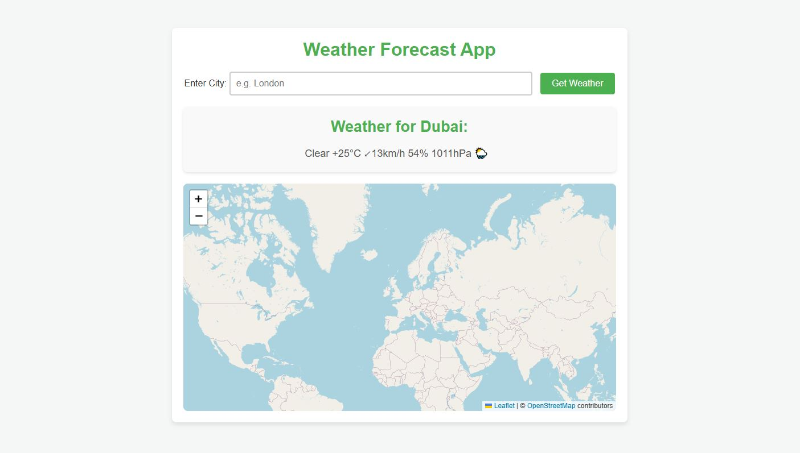

# 🌤️ Weather Forecast App 🌦️

A simple Flask-based web application that allows users to get real-time weather information for any city. The weather data is fetched from the [wttr.in](https://wttr.in/) service, and the app displays the weather conditions along with relevant emojis.

## ✨ Features 

- 🌍 Enter a city name to get the current weather.
- ☀️ Displays weather conditions (e.g., Sunny, Cloudy, Rainy) along with emojis 🌞🌧️❄️.
- 🖥️ Simple, user-friendly interface.

## ⚙️ Installation 

1. Open CMD 🖥️


| **Operating System** | **Steps**                                                                                                                   |
|----------------------|-----------------------------------------------------------------------------------------------------------------------------|
| **Windows** 💻        | 1. Press `Windows + R` to open the "Run" dialog box. <br> 2. Type `cmd` and hit `Enter`. <br> 3. The Command Prompt (CMD) will open. <br> Alternatively, you can search for "Command Prompt" in the Start menu and click to open it. 🔍 <br> 4. To navigate to the Desktop, type `cd %USERPROFILE%\Desktop` and hit `Enter`. 📂        |
| **Linux** 🐧          | 1. Press `Ctrl + Alt + T` to open the terminal. <br> 2. Alternatively, search for "Terminal" in your applications menu. 💨 <br> 3. To navigate to the Desktop, type `cd ~/Desktop` and hit `Enter`. 📂        |

2. Clone the repository:
```bash
git clone https://github.com/LaithALhaware/Weather-Forecast-App.git
cd Weather-Forecast-App
```

3. Install the required dependencies :
```bash
pip install -r requirements.txt
```

## 🚀 Usage 
Run the app on Web Page :
```bash
python app-GUI.py
```
Open your browser and visit `http://127.0.0.1:5000/` to use the app.
 
Run the app on CMD :
```bash
python app-CMD.py
```

## 🗂️ Project Structure 
```bash
Weather-Forecast-App/
│
├── app-GUI.py            # Main Flask application file
├── app-CMD.py                
├── templates/
│   └── index.html        # HTML template for the weather app
├── requirements.txt      # List of project dependencies
└── README.md             # This file
```


## 📝 License
This project is licensed under the **License**. See the [LICENSE.txt](LICENSE.txt) ⚖️ file for details.

---
## ❤️ Support This Project
If you find this project useful, consider supporting its development:

💰 Via PayPal: [[PayPal Link](https://www.paypal.com/ncp/payment/KC9EETJDVZQHG)]

Your support helps keep this project alive! 🚀🔥
